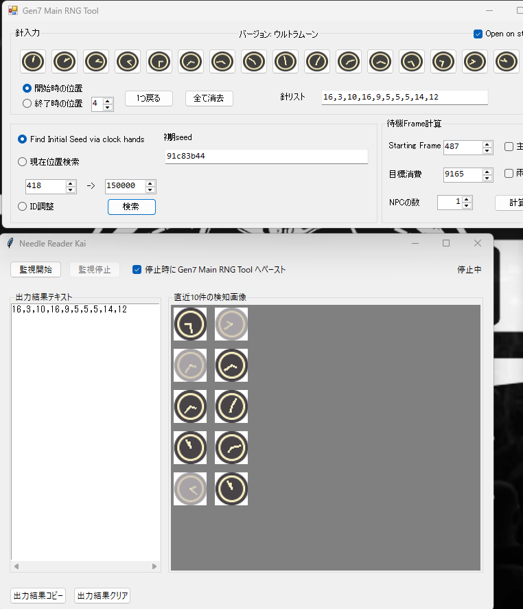

ポケットモンスターウルトラサン・ウルトラムーンの乱数調整で使えるNeedleReadの改良版です。

偽トロキャプチャ専用です。

従来版は画像を見て針入力を手動で行う必要がありましたが、画像から針番号を自動で識別してテキストボックスに出力出来ます。

また、RNG Tools側の針リストテキストボックスにカーソルが合っていれば監視終了時点で結果をペーストしてくれます。

カーソルが合っていなくともクリップボードにコピーしているので貼り付けるだけで針リストの入力が完了します。

3DS Viewerの設定は以下にしてください。

転送モード：Light Weight Mode

フィルター：No Filter

等倍調整：dot by dot x2

上下表示：上下画面表示、上下比率50%:50%

